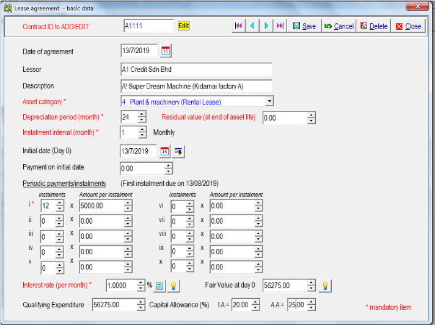
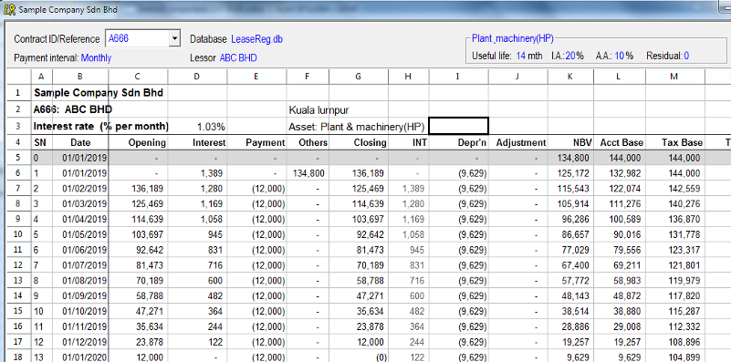
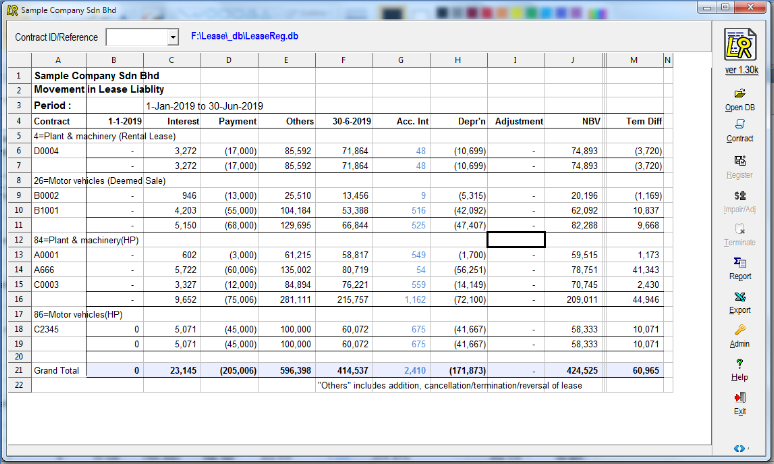
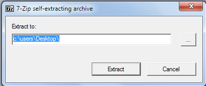
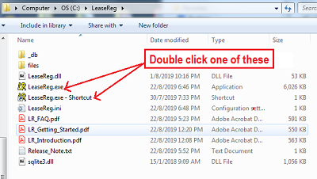

# LeaseReg-Software
LeaseReg is a computer software which help us to keep track and account for lease transactions (particularly for lessee accounting). 	

It is a simple application which include three main functions :-	

1.	Data entry – Input of basic data pertaining to each lease contract  e.g. lease term, interest rates, lease payment etc.

	

2.	Adjustments for impairment, reversal, termination and cancellation during the lease period;
 
3.	Create reports

	a. Lease Schedule showing the balance of lease assets/liabilities, temporary differences (for deferred tax purpose) at end of each 		 month, lease payment and interest for each and other useful information;
	
	

	b. Periodic summary report for all the lease contracts in the database.
	
	

Installation procedure

1. Download the latest version from https://github.com/kjteng/LeaseReg-Software.  Save the downloaded file (LeaseRegX_XXX.exe, X_XXX is the version number);

2. Double click LeaseRegX_XXX.exe. When the following screen appear, key in or select the location where you want to extract LeaseReg software.

	

3. Click [OK] button. Al the necessary files will then be extracted and saved in a folder called "LeaseReg' (at the location selected in step 2 above);

4. You can now start the program by double click on 'LeaseReg.exe - Shortcut' or 'LeaseReg.exe' from the 'LeaseReg' folder.

	
