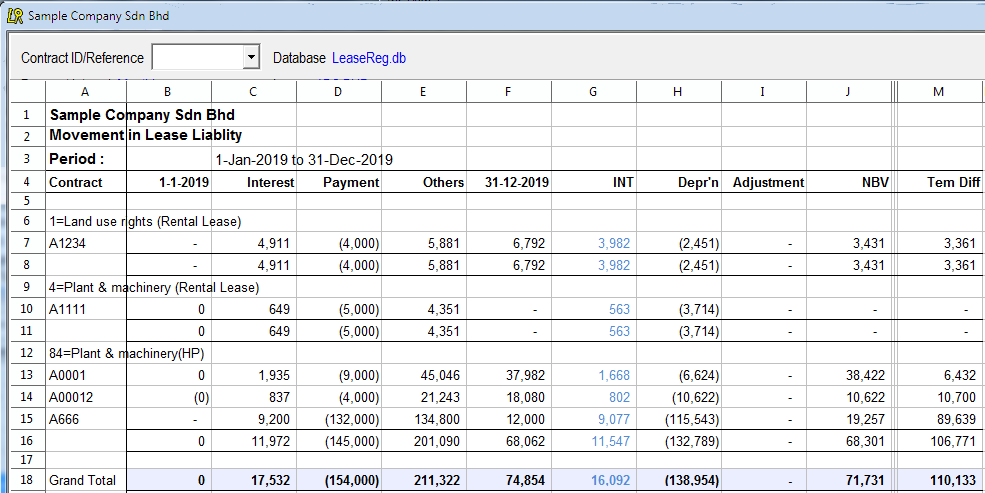

# LeaseReg-Software
LeaseReg is a computer software which help us to keep track and account for lease transactions (particularly for lessee accounting). 	

It is a simple application which include three main functions :-	

1.	Data entry – Input of basic data pertaining to each lease contract  e.g. lease term, interest rates, lease payment etc.
	

2.	Adjustments for impairment, reversal, termination and cancellation during the lease period;
 
 
3.	Create reports

	a. Lease Schedule showing the balance of lease assets/liabilities, temporary differences (for deferred tax purpose) at end of each 		 month, lease payment and interest for each and other useful information;
	
	

3.	Create report (cont’d)

	b. Periodic summary report for all the lease contracts in the database.
	
	
